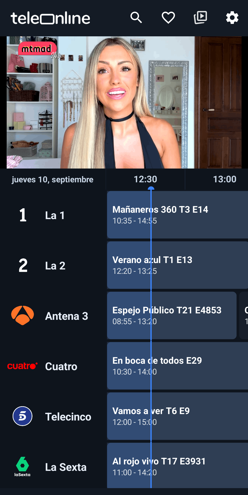
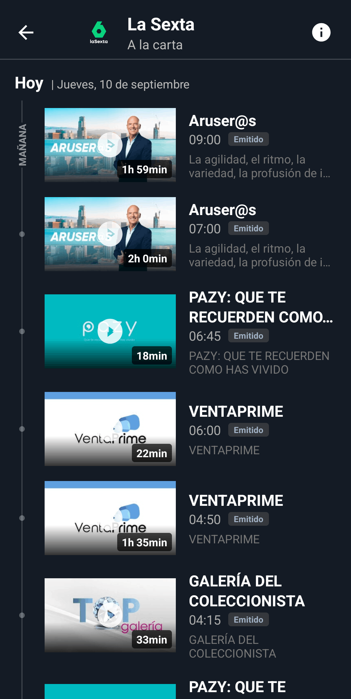
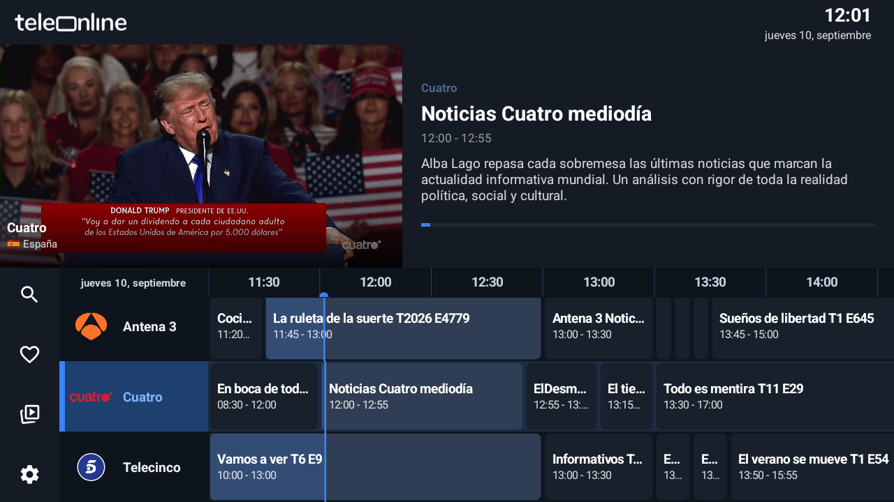

# Teleonline (Application)

*[Versión en español](README.md)*

Teleonline is a media playback application for Android that centralizes access to television channels through M3U8 playlists and standard streaming protocols (HLS/DASH).

It includes an electronic program guide (EPG) with a reminder system, favorites list management, and support for custom playlists and EPG guides defined by the user.

The application has two independent interfaces, each optimized for its platform: one for mobile and tablet, and another for Android TV and Google TV with full remote control navigation.

## Table of Contents

- [Download](#download)
- [What's included](#whats-included)
- [Screenshots](#screenshots)
- [Requirements](#requirements)
- [Installation](#installation)
  - [Mobile or tablet](#mobile-or-tablet)
  - [Android TV or Fire TV](#android-tv-or-fire-tv)
- [Support](#support)
- [Legal](#legal)

## Download

Download the latest version **[here](../../releases/latest)**

## What's included

- Program guide with reminders
- "On demand" content: programs aired in the last 7 days
- VOD content from public broadcasters
- Editable favorites list
- Support for custom playlists (M3U) and custom guides (EPG/XML)
- Full-featured player: quality selection, audio and subtitles, screen lock, sleep timer, background playback, gestures, and remote zapping
- Sync across devices
- Available in Spanish, English, Catalan, Basque, and Portuguese

Note: The application is continuously improved over time, so this feature list may not be exhaustive.

## Screenshots

### Android

<table>
  <tr>
    <td width="33%"></td>
    <td width="33%"></td>
  </tr>
  <tr>
    <td align="center">Home screen</td>
    <td align="center">On-demand screen</td>
  </tr>
</table>

### Android TV

<table>
  <tr>
    <td width="100%"></td>
  </tr>
  <tr>
    <td align="center">Android TV interface, navigable with a remote control</td>
  </tr>
</table>

## Requirements

Android 5.0 or higher.

## Installation

### Mobile or tablet

1. Download the APK from **[Releases](../../releases/latest)**
2. Open it on your device
3. Since it does not come from Google Play, Android will show a security warning and ask for permission to install apps from unknown sources. This is standard system behavior for any APK installed outside the official store
4. Grant the permission and install

### Android TV or Fire TV

1. Install **Downloader** from your TV's app store
2. Open it and press the **#** icon
3. Enter code **4713504** and press Go
4. Allow Downloader to install apps if prompted
5. Install

Guide with screenshots: [teleonline.app](https://teleonline.app)

## Support

Bugs and suggestions → [Issues](../../issues) tab

## Legal

**Legal notice.** This application is a player for M3U8 playlists and program guides, not a broadcasting or content distribution platform. 
The application does not host, store, or retransmit any audiovisual content. The application and its creators assume no liability whatsoever. Use of the application is the user's responsibility, who must comply with the legislation in force in their country regarding access to audiovisual content.

**Privacy.** The application does not require registration or a user account. Custom channel lists, custom program guides, favorites, and settings are stored only on the device and are never sent to first- or third-party servers. The application does not include advertising or third-party modules unrelated to this purpose.
